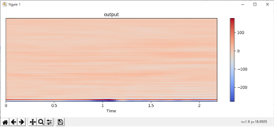
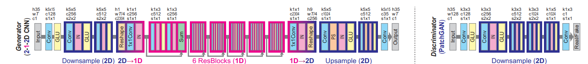

# Singing Voice Conversion

### Goal

> Change Singer A's voice to Singer B's voice without any 

### Result

>   

>   

### Paper

> CycleGAN-VC2: Improved CycleGAN-based Non-parallel Voice Conversion
>
>     

